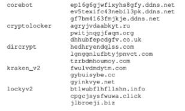
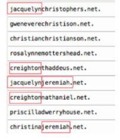
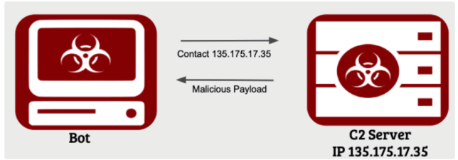
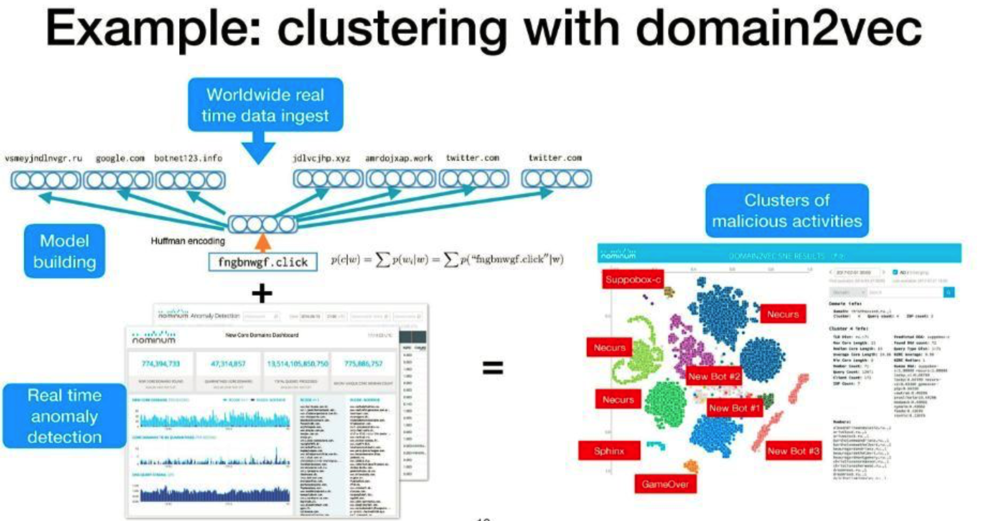

## DGA

优势：可以避免被防火墙硬编码式直接封禁

一般流程：种子+若干移位操作

~~~
种子：种子可以使任何在不断变化的伪随机输入数值。常见的种子有日期、汇率等。
~~~

伪随机类DGA详细生成流程可以参考这篇文章：[A Death Match of Domain Generation Algorithms](https://medium.com/@yvyuz/a-death-match-of-domain-generation-algorithms-a5b5dbdc1c6e)

### 分类

DGA从大体上上可以分为字典型DGA与非字典型DGA两种。

非字典型域名主要采用各种编码方式使域名变得非常随机化，检测主要从DGA域名与正常域名的随机性差别进行检测；

字典型DGA域名由一个字典的随机组合生成DGA域名，这种域名单个拿出来与正常域名在域名字符上表现差别不大，但对于主机请求的大量域名的分析还是会发现与正常域名的不同之处，一般从图角度进行分析。

### 工作原理

攻击者会在DGA域名生成的众多域名中注册少数域名，将其对应的IP地址设置为C2服务器地址，受控僵尸机会对DGA域名生成算法生成的全部域名进行请求，大部分域名由于没有真的被注册，因此会返回NXdomain，当僵尸主机访问到被注册的DGA域名时，DNS服务器将返回C2地址，然后，僵尸机即可连接到C2服务器。

### 检测思路

#### 1. 域名字符集特征的判别模型

&emsp;&emsp;这里一类DGA检测算法目前更受欢迎，因为其更容易做成在线模型，并且不需要为各种DNS日志更新模型，对于安全盒子类不会穿DNS日志的场景更加友好。

**特点**: 

- 在线模型
- 不需要为各种日志更新模型
- 未知DGA检测能力较弱

|      |                      统计特征+机器学习                       |                             LSTM                             |
| :--: | :----------------------------------------------------------: | :----------------------------------------------------------: |
| 优势 | 1. 可解释性好，便于模型调整与后期运营； 2. 即使面对对抗攻击与误报，也能为安全运营提供决策依据。 |               建模简单，对安全专家的以来程度低               |
| 不足 |                     依赖专家进行特征设计                     | 1. 容易受到到对抗攻击 2. 对非随机字典类DGA表现差 3. 难以运营 |
| 代表 | **1. CrowdStrike 2013 BlackHat（业界最早）**：End-to-End Analysis of a Domain Generating Algorithm Malware Family **2. FANCI（最新典型）** : Feature-based Automated NXDomain Classification and Intelligence | 1. **LSTM.MI**(非平衡分类的改进):A LSTM based framework for handling multiclass imbalance in DGA botnet detection |

> 1. LSTM类检测模型的攻击
>
>    LSTM类DGA检测模型在大量的研究中表明很容易收到攻击，无论是在已知训练集或模型结构的白盒攻击还是未知的黑盒攻击，都能很轻易影响模型的效果。
>
>    - 白盒攻击：《CharBot: A Simple and Effective Method for Evading DGA Classifiers》
>
>      从训练数据集的反例里随便找一个域名并选取两个随机位置替换为另外两个随机字符，再随机替换其 TLD，这样的简单的攻击可将 LSTM.MI 等模型准确率降低到 90% 而检测率甚至可以低到 30% 左右
>
>    - 黑盒攻击：《MaskDGA: A Black-box Evasion Technique Against DGA Classifiers and Adversarial Defenses》
>
>      过简单的对抗生成得到一个很浅的网络，已经可以 LSTM.MI 等模型的 F-1 score 从 0.977 降到 0.495
>
> 2. LSTM型DGA检测模型实际应用效果欠佳的原因分析：
>
> ​	一般伪随机DGA的生成流程一般为：基于日期的随机数种子+若移位操作生成一列的字符串
>
> ​	LSTM模型等RNN网络并不能学习到移位操作，能够学习到的仅仅是在固定数据集上利用字符的n-gram组合拟合出的DGA算法的结果，但是这种结果很有可能是恰好在当前数据集上具备此种表现，但并是判别DGA的有效特征。

#### 2. DNS流量序列特征模型

**事实依据**：由于通过DGA生成算法生成的DGA域名都会进行发送请求，因此会出现一个存在较强关联的DNS域名查询序列，而这个DNS查询序列中又存在大量不存在的域名，因此其中的大量域名都会返回NXDOMAIN

**核心思路**：对每个IP地址的DNS域名查询序列取滑动窗口，对其中出现的域名以word2vec的方式做向量表示，然后利用分类或聚类模型找出符合DGA网络行为的域名（例如大量查询NXDOMAIN）。

代表工作：

- word2vec+LR:《Domain-Embeddings Based DGA Detection with Incremental Training Method》
- word2vec+DBSCAN：《[用机器智能解决网络安全问题：基于DNS的实践](https://cloud.tencent.com/developer/news/144240)》【实践，实用性强，2018】

#### 3. DNS流量共现特征模型

**核心思路**：同一家族的DGA域名会在一段时间内共同发起类似的DNS请求，因此对同一时间段内的域名发起的IP地址做统计，使用矩阵相乘获得域名被多少IP地址访问，然后将矩阵关系转化为图：将存在大于N个共同发起访问的IP连接边，然后使用Louvain算法进行聚类，最后找出符合DGA的类。

**代表工作**：《A DGA Odyssey PDNS Driven DGA Analysis》

### URL DataSet

- [*Malware Domain List*](https://www.malwaredomainlist.com/mdl.php)

  提供各种类型的url数据

- [*Phishtank*](钓鱼数据库)

  钓鱼URL专门的开放式数据库

- [Google Safe Browsing](https://safebrowsing.google.com/)

  Google安全浏览器为开发者提供了API判断一个URL是否为恶意URL，免费用于非商业用途，商业用途需要交涉。

-  [*VirusTotal*](https://www.virustotal.com)

  Virustotal同样提供了恶意URL和恶意文件的检测服务，并返回它的检测报告。

### Paper&Blog

1. Hyrum S. Anderson, Jonathan Woodbridge, Bobby Filar. "**DeepDGA: Adversarially-Tuned Domain Generation and Detection**" [[pdf\]](https://arxiv.org/abs/1610.01969),6 Oct 2016 **(生成对抗网络，DGA检测)** 

   这篇论文是首个尝试使用生成对抗网络与自动编码器来生成DGA域名的方案，其中各部分的工作方式与作用分别为：

   - auto-encoder
     - 使用Alexa top 1m中的正常域名作为训练集对自动编码器进行训练，使其能够学习到正常模型的embedding表达方式。
     - encoder：输入域名，其能够输出符合正常域名字节分布规律的embedding表示
     - decoder：输入符合正常域名分布规律的embedding，解码为域名
   - GAN
     - 将训练好的encoder和decoder固定权重后分别接generator layer和logistic regression，作为GAN的生成器与判别器，训练时只对新加入的generator layer和logistic regression进行训练
     - 生成器：输入随机种子，generator layer生成与正常域名相似的embedding，然后由decoder负责还原成DGA域名（与征程域名相似的）
     - 判别器：输入域名，使用encoder将域名转化为embedding表示，然后使用lr判断是不是真正的正常域名。

   论文的整体思路比较新颖，**核心思路是通过控制生成DGA域名的字符分布更加趋近于正常域名的分布从而逃过检测**，实验环境下，可使随机森林检测模型对该种DGA域名的检出率不到50%，但是**实际使用使要考虑深度学习模型训练过程中的随机性问题，DGA域名要求使用同一种子，多次复现过程中生成的域名必须要是相同的**。

2. Jonathan Woodbridge, Hyrum S. Anderson, Anjum Ahuja, Daniel Grant. "**Predicting Domain Generation Algorithms with Long Short-Term Memory Networks**" [[pdf\]](https://arxiv.org/abs/1611.00791),2 Nov 2016 **(LSTM,DGA检测)**

3. Manos Antonakakis, Damballa Inc. and Georgia Institute of Technology.  "[From Throw-Away Traffic to Bots: Detecting the Rise of DGA-Based Malware](https://www.usenix.org/system/files/conference/usenixsecurity12/sec12-final127.pdf)",2012. **(DGA,图，谱聚类)**

4. Khalil, I., Yu, T., & Guan, B. (2016). **[Discovering Malicious Domains through Passive DNS Data Graph Analysis](sci-hub.se/10.1145/2897845.2897877).** Proceedings of the 11th ACM on Asia Conference on Computer and Communications Security - ASIA CCS ’16.

5. FANCI : Feature-based Automated NXDomain Classification and Intelligence，usenix security18

### Blog

#### 1. [机器学习与威胁情报的融合：一种基于AI检测恶意域名的方法](https://www.freebuf.com/articles/es/187451.html)

  &emsp;&emsp;改文章基于购买的微步的威胁情报中包含的恶意域名作为恶意黑样本构建的恶意域名检测模型，其中采用的一些对比较经典的特征，最终模型**误报率和漏报率均在3%左右**，整体效果还是一般。有构建这方面模型的道友可以将其作为base在其上进行进一步的完善。其中包含的主要特征包括：**Alexa排名、搜狗rank、搜狗与百度的收录数量、必应收录数量、网站首页完整度、是否是主流域名后缀、地理位置、地理位置**。

  其实对于在微步购买的威胁情报中所包含的恶意域名，文章作者已经认识到其标记并不准确，其中也存在包含了alex排名前1000的域名等问题，但是作者并没有在构建训练集时将这些有问题的数据进行剔除，在进行相关任务时应该注意样本集的清洗。

#### 2. [DNS Tunnel隧道隐蔽通信实验 && 尝试复现特征向量化思维方式检测](https://www.cnblogs.com/LittleHann/p/8656621.html#_label3_1_4_0)

&emsp;&emsp;阿里云的在进行DNS隐蔽信道时写的一篇记录文章，文章中首先比较系统的讲述了`IP直连型DNS隐蔽信道、域名型因隐蔽信道两种常见的隐蔽信道`，然后`使用Powershell+dnscat2实现DNS隐蔽隧道反弹Shell进行实际的隐蔽信道木马搭建，获取通信过程的隐蔽信道流量进行分析`，最后`非常全面的讲述了进行DNS隐蔽信道检测可以采用的特征`，其中的`ZIf定律、FQDN数`等都是非常新颖的特征，是一篇做DNS隐蔽信道检测难得的好文。

&emsp;&emsp;在该文章中还提到了在DNS隐蔽信道检测的实际应用中的一个比较核心的问题：`如何区分DNS隐蔽信道和DNS Flood攻击`。

> 1. ZIf定律
>
> &emsp;&emsp;`根据Zif定律，在自然语言的语料库里，词频往往会集中于某些小子集中，并且高频词到低频次的频率逐渐下降`。而在DNS Tunneling中由于域名做了编码，不符合Zipf定律，整个分布趋于平稳。因此可以通过`通过检测排序后的词频平均斜率`来检测input string是否符合zipf law规律。
>
> 2. FQDN
>
> &emsp;&emsp;域名有全称和简称的区别。全称的域名，直译为"完全的合格的域名"(FQDN，Fully Qualified Domain Name)，表现为由"·"隔开的点分式层次结构，叫名称空间， 它指定了一台主机和它所属域的隶属关系，而简称通常就是这台主机的计算机名，在域名的最左边。`FQDN(完全合格的域名)，是域加计算机名的总称`。比如: www.microsoft.com 这个FQDN 中，www 是主机名，microsoft.com 是域。 www.microsoft.com 组合在一块就成了一个完整的域名(FQDN)。可以通过分析一定时间窗口内所产生的FQDN数，`通常DNS Tunneling的FQDN数在一定时间窗口内会远高于正常的DNS流量`。

#### 3. [图/Louvain/DGA乱谈](https://www.cdxy.me/?p=805)

#### 4. [使用社区发现算法从企业内部无效域名中挖掘DGA](http://www.webber.tech/posts/%E4%BD%BF%E7%94%A8%E7%A4%BE%E5%8C%BA%E5%8F%91%E7%8E%B0%E7%AE%97%E6%B3%95%E4%BB%8E%E4%BC%81%E4%B8%9A%E5%86%85%E9%83%A8%E6%97%A0%E6%95%88%E5%9F%9F%E5%90%8D%E4%B8%AD%E6%8C%96%E6%8E%98DGA/)

#### 5. [DNS安全皮毛](https://xz.aliyun.com/t/5991)

#### 6. [A Word Graph Approach for Dictionary Detection and Extraction in DGA Domain Names](https://machine-learning-and-security.github.io/slides/Mayana-final-of-NIPS-DDGA.pdf)

#### 7. [用机器智能解决网络安全问题：基于DNS的实践](https://cloud.tencent.com/developer/news/144240)

&emsp;&emsp;对每个IP地址的DNS域名查询序列取滑动窗口，对其中出现的域名以word2vec的方式做向量表示，然后利用分类或聚类模型找出符合DGA网络行为的域名（例如大量查询NXDOMAIN）。

